

  

<h1 align="center">Hi, I'm Manjunatha P</h1>

  Backend Developer | Cybersecurity Enthusiast | Systems Explorer

  

  

  I enjoy building backend systems, understanding how infrastructure behaves, and sharpening my
  problem-solving through security practice and hands-on debugging.

## About Me

- Backend-focused developer with a strong interest in Java, Python, and systems thinking
- Curious about cybersecurity, networking, traffic analysis, and defensive security workflows
- Comfortable with DSA, OOP, debugging, and learning by breaking things carefully
- Based in Mysuru, India

## Languages & Technologies

All of the logos below are stored locally in this repo so the profile stays clean and stable on GitHub.

### Programming Languages

  
  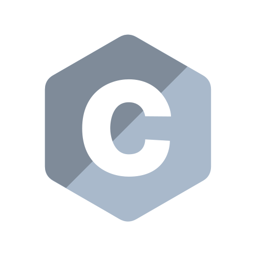
  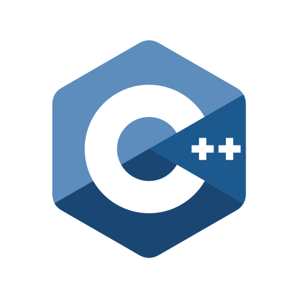
  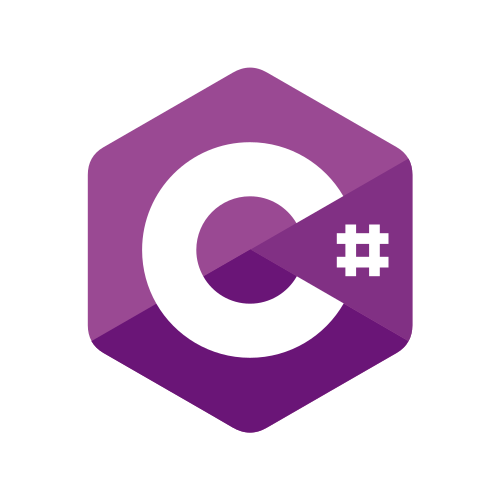
  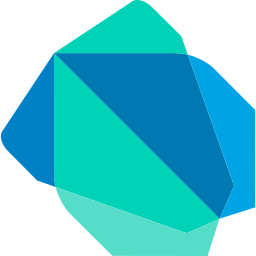
  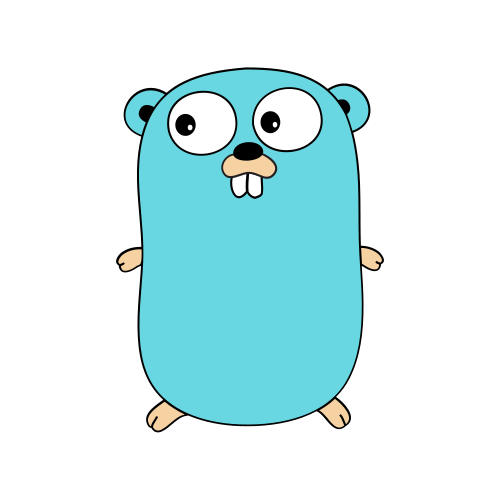
  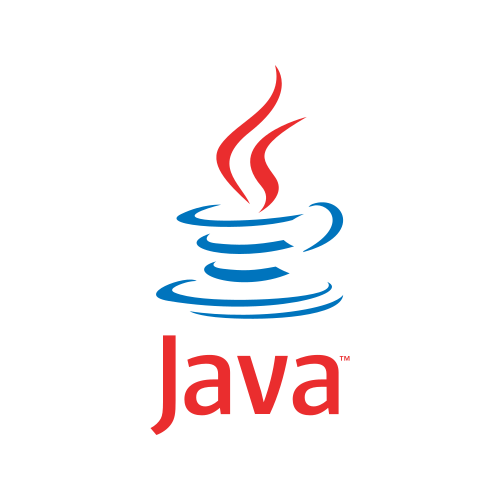
  
  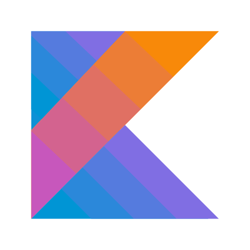
  
  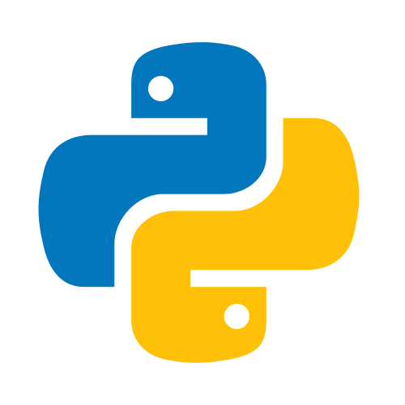
  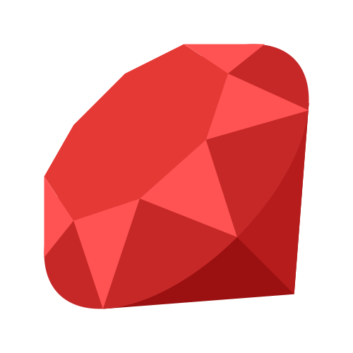
  
  

### Frontend & Frameworks

  
  
  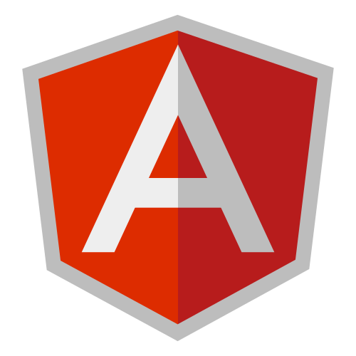
  
  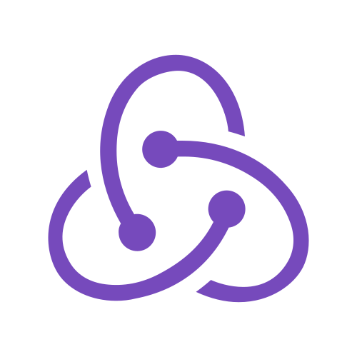
  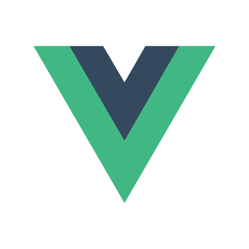
  
  
  

### Backend & Databases

  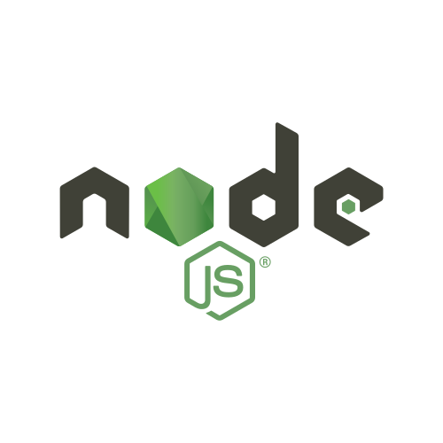
  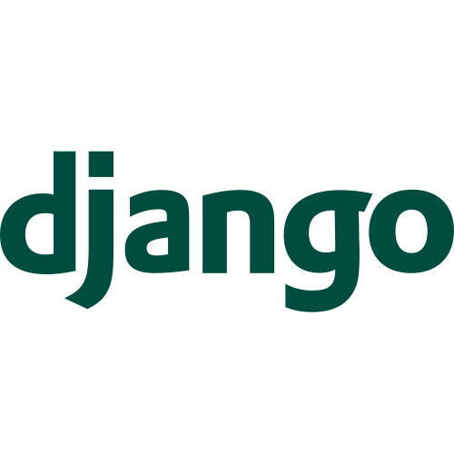
  
  
  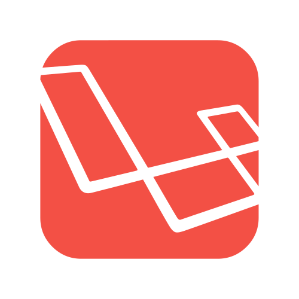
  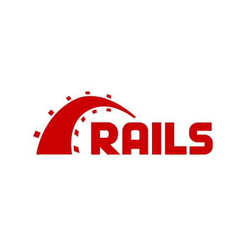
  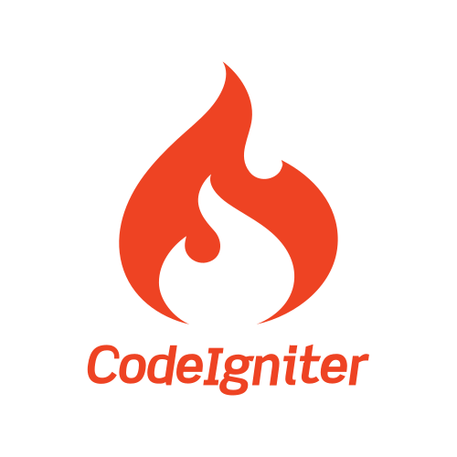
  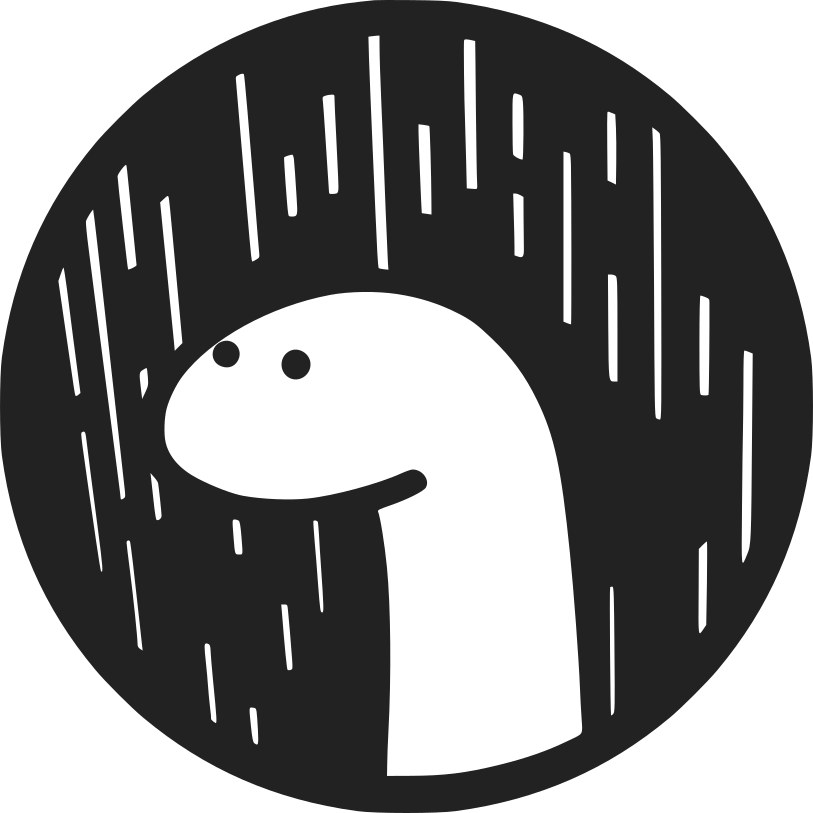
  
  
  
  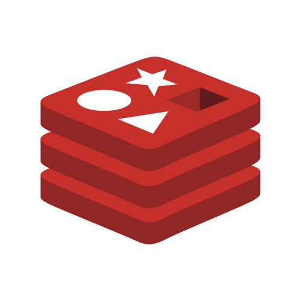
  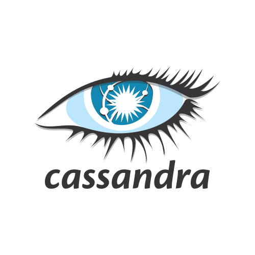
  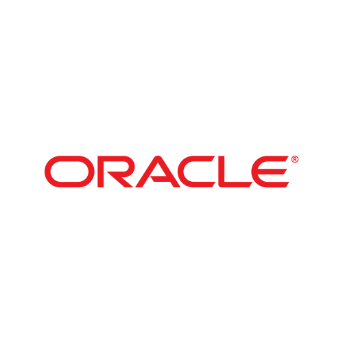

### Cloud & Dev Tools

  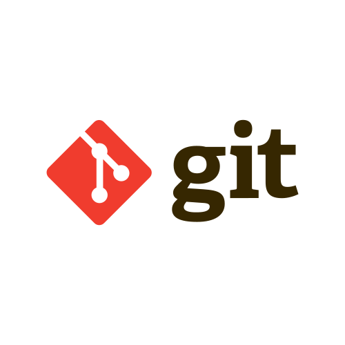
  
  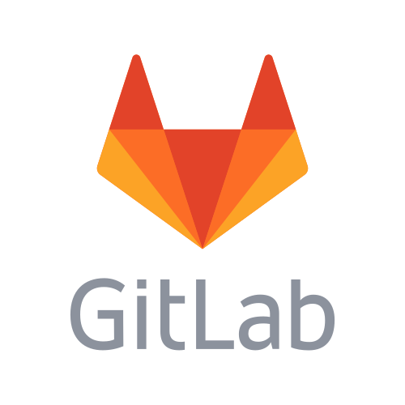
  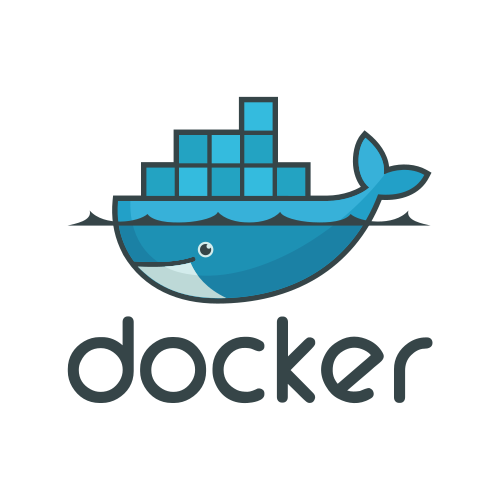
  
  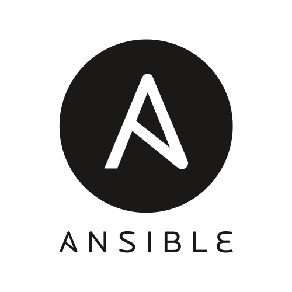
  
  
  
  
  
  

### Editors & IDEs

  
  
  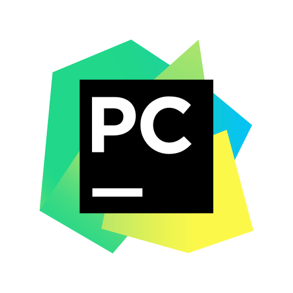
  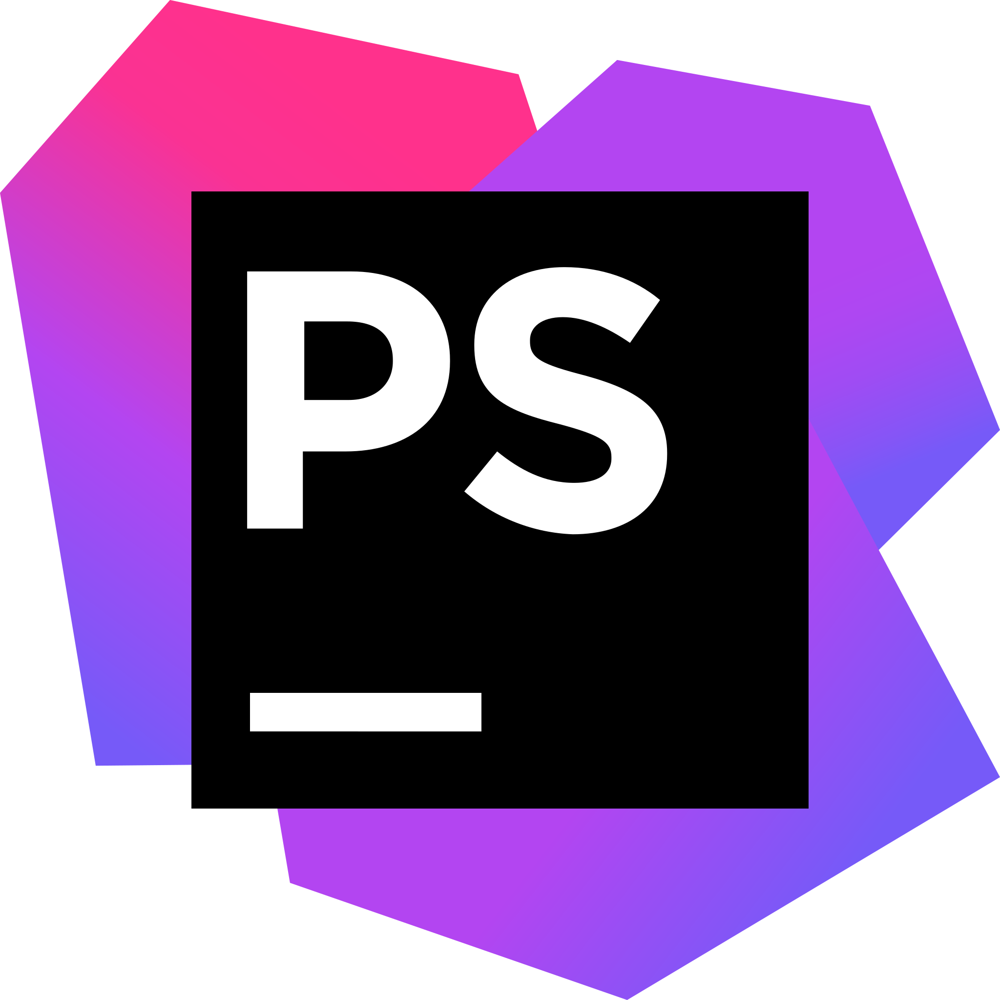
  
  
  
  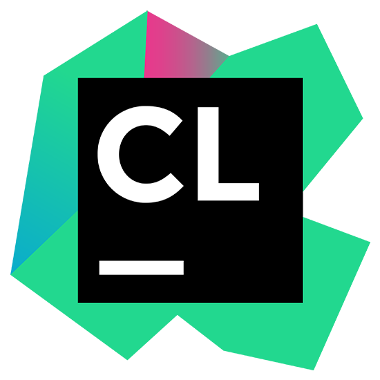
  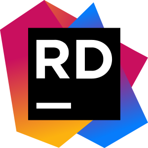
  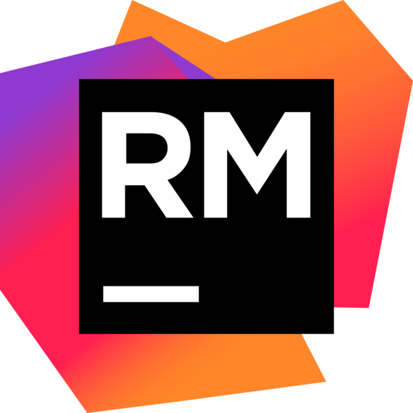
  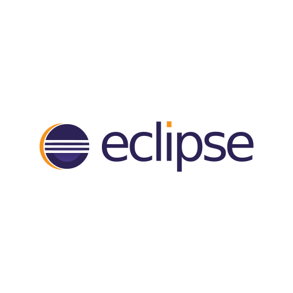
  
  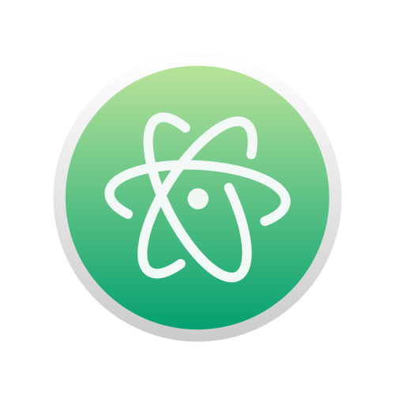
  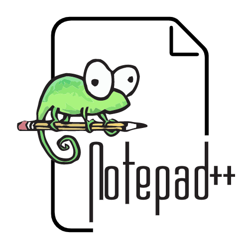

## LeetCode

  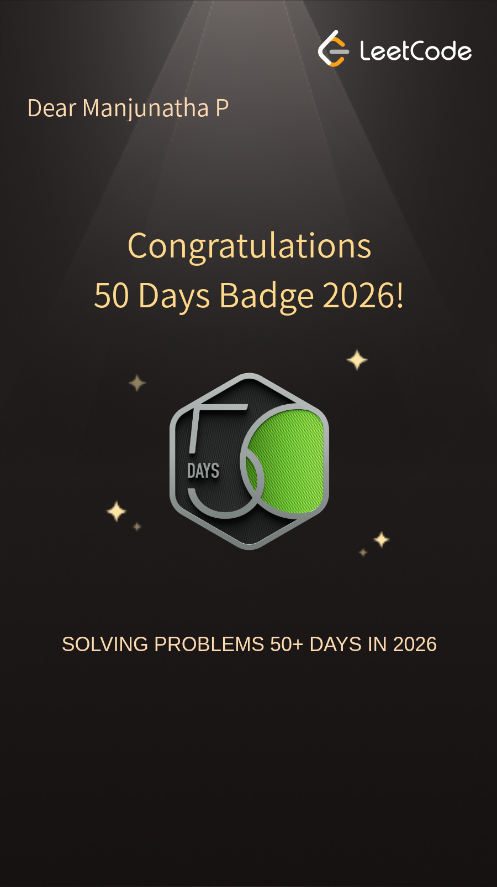

  Consistent DSA practice and problem-solving through LeetCode.

  

## Cybersecurity & Systems

- Wireshark, tcpdump, Nmap, SIEM workflows, and log analysis
- Interested in Linux, networking, threat detection, and backend security fundamentals
- I like learning through hands-on experimentation, debugging, and careful system exploration

## Connect

- GitHub: [namelessweakl1ng](https://github.com/namelessweakl1ng)
- LeetCode: [namelessweakling](https://leetcode.com/u/namelessweakling/)
- Portfolio: [manjunathap.vercel.app](https://manjunathap.vercel.app/)

  

